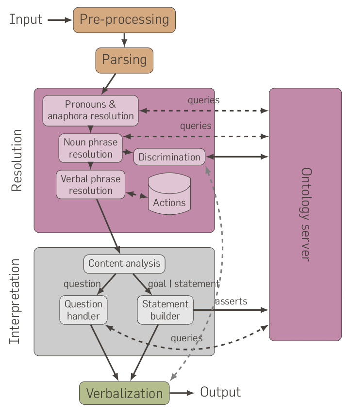

Dialogs: A Naive Natural Language Processing
============================================

(c) LAAS-CNRS 2010-2013, EPFL 2013, 2014

This module, licensed under the permissive BSD 3-clause, reads on stdin user
input in natural language, parse it, call resolution routines when ambiguous
concepts are used, and finally generate RDF statements that are an
interpretation of the input.

It includes as well a verbalization module that conversely turns RDF statements
into a sentence in natural language.





While not strictly required, it is strongly recommanded to use `dialogs` with a
knowledge base that follows the ''KB API'' like
[minimalKB](https://github.com/severin-lemaignan/minimalkb/) or
[oro-server](http://oro.openrobots.org).

You are welcome to reuse this software for your research. Please refer to the
CITATION file for proper attribution in scientific works.

Installation
------------

Simply run:

```
> pip install dialogs
```

Usage
-----

```
> dialogs --help
```

should help you to start.

Common invokation is:

```
> dialogs -d NAME_OF_THE_SPEAKER
```

The main test-suite can be started with:

```
> dialogs_test
```

Demo
----

A live demo of the *parser alone* (not the semantic grounding part) is
[available online](https://chili-research.epfl.ch/dialogs/).

